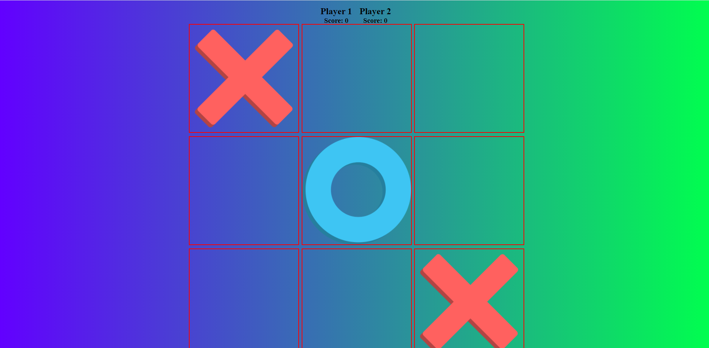

# Tic-Tac-Toe

link to project: https://danstan-tic-tac-toe.netlify.app/

## Tech used 
HTML, CSS & Vanilla JavaScript

A simple Tic-Tac-Toe between two human players. The first player that gets to align 3 items of either 'x' or 'o' vertically, horizonally or diagonally in a row wins the game.

