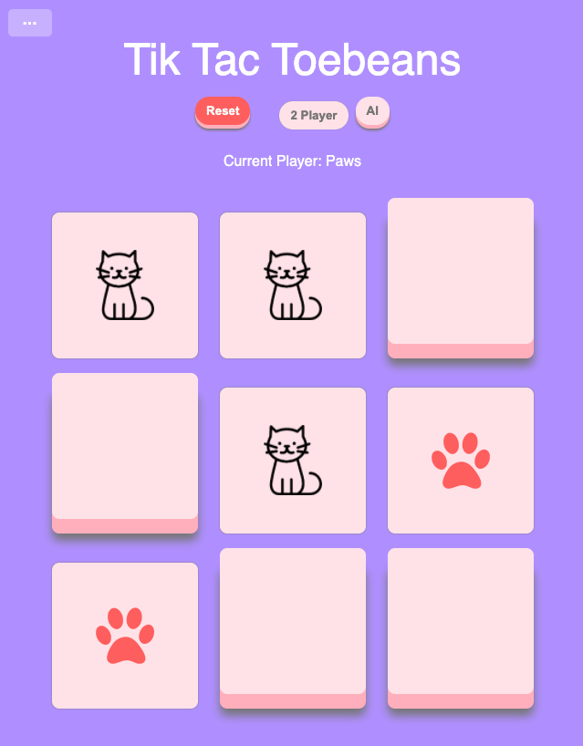

# Tic Tac Toebeans

This application was made for a coding challenge to create a Tic Tac Toe game. A great exercise in creating objects, embedded objects, and object constructors. Styled so that there are visual cues for what has been selected and when the game is over.

## Current Hosting

To see deployed site, visit [The Application here](https://jpmbvistro-tictactoebeans.netlify.app/)
See my other deployed projects there as well!

## Work With Me

If you would like to work with me, feel free to contact me through [my website](https://www.jpmbvistro.com), my [LinkedIn](https://www.linkedin.com/in/juan-justin-vistro/), or email me directly [jpmbvistro@gmail.com](mailto:JPMBVistro@gmail.com)

## Screenshots

### Contributions
At this moment, I am currently not accepting contributions for this project.
