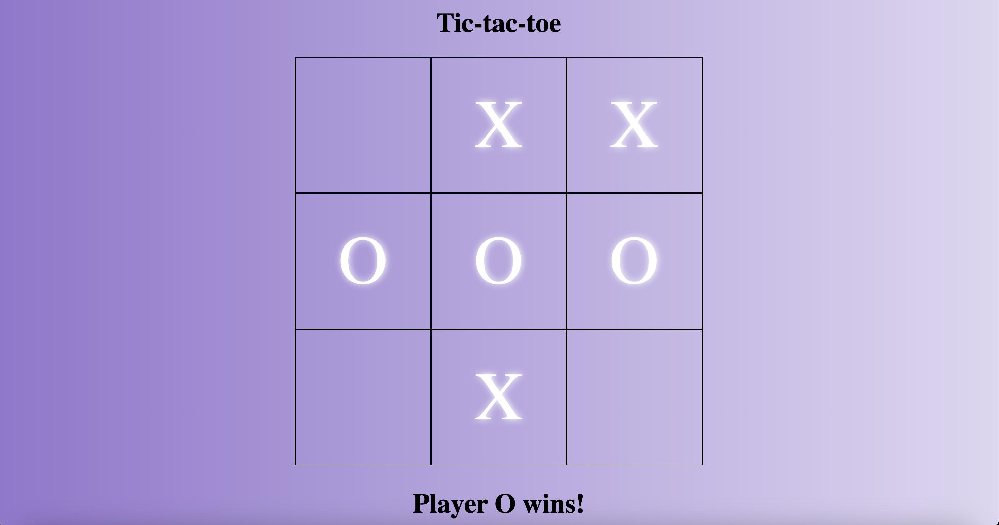

### Goal: Create a two player Tic-Tac-Toe game. The users should be able to click to place their X or O and if they win the program should mention their win in the DOM. Please make the game as OOP as possible.

Link to project: https://alejandralondev.github.io/tic-tac-toe/ 

How It's Made:
Tech used: HTML, CSS, JavaScript

This project took a ton of pseudo coding as the javascript was tricky to nail down. I wanted to make sure I understood every aspect of logic on the game and every line of code. There was plenty learned along the way. One of the more challenging parts were checking if a player won. I used a for loop and checked the iterations by manipulating adding and multiplying my iterations to reach the desired 3 number pattern check. It was a lot of research!

Lessons Learned:
I learned that the more pseudo code I do, the better I can track my thought process and understand my code should I step away from it for awhie. I also learned to research, research, research and then research some more. I took in examples, documentation on for loops, videos on building similar apps, and more.