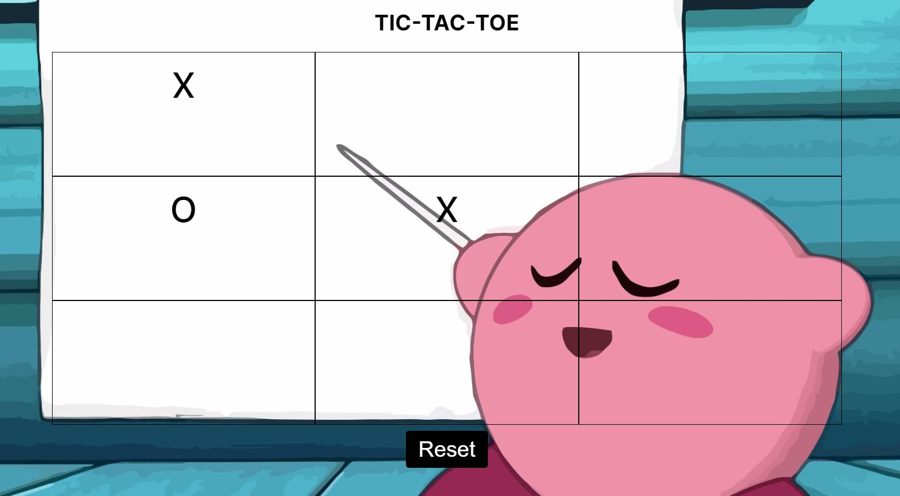

# Tic-Tac-Toe Game
A two player Tic-Tac-Toe game. Users are able to click to place their X or O and if they win an alert pops up.

Link to project: https://menahassan-tic-tac-toe.netlify.app/

# How It's Made
Tech Used: HTML, CSS, and JavaScript

# Lessons Learned
This project was a chance to apply some knowledge on a programming paradigm called object-oriented programming (OOP). I learned that, in JavaScript, most things are objects and classes are like templates for objects. Classes define what methods (functions) and properties (variables) an object has. A helpful analogy I learned was that classes are like recipes for a cake. If you make a cake with that recipe, the cake is an object and an instance of the recipe. 

