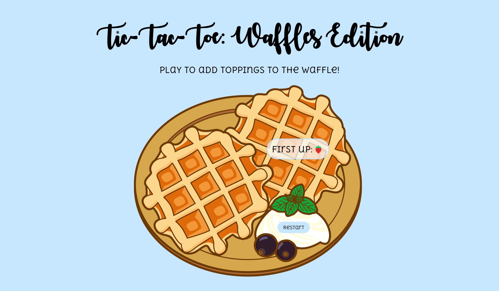

# Tic-Tac-Toe: Waffles Edition

### Description
This project implements a basic Tic-Tac-Toe game using vanilla JavaScript. It allows two players to take turns placing their symbols on a 3x3 grid. The game checks for wins and draws and displays the results accordingly. Check it out <a href="https://xsarahyu.github.io/tic-tac-toe/">here</a>!

### Features
- Simple and intuitive user interface
- Real-time feedback on the game status
- Proper handling of win and draw scenarios

### Tech Used
- HTML
- CSS
- JavaScript

### Lessons Learned
- How to use constructors to create objects and methods.
- Trick: Make an independent element equal "false" and use it as a conditional to prevent certain functions from running.
- How to create CSS animations.