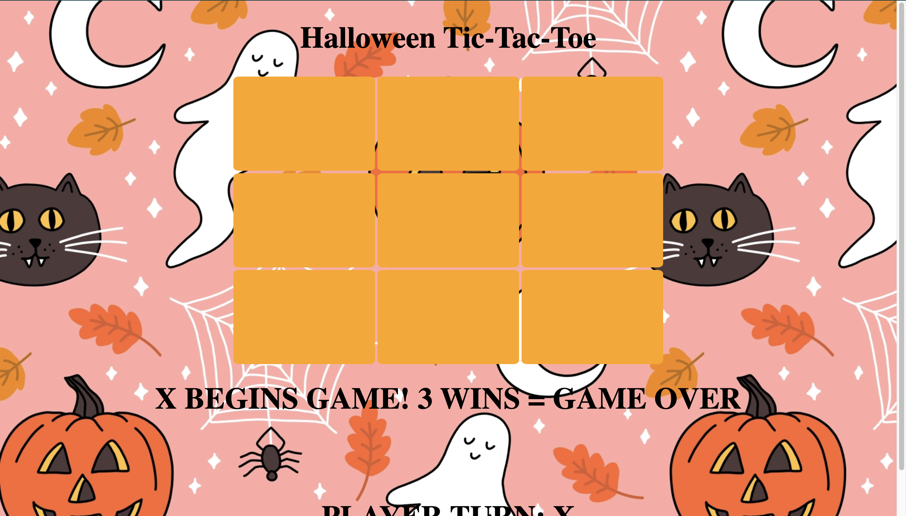

# 🎰 Week07 Bootcamp2021 Project: Tic-Tac-Toe Game

### Goal: Build a Simple Tic-Tac-Toe Game

This is my simple tic-tac-toe game project! The game will be played by two players sharing the screen. X will always go first and the game does not start until X goes. Players must match 3 tiles in order to win.

</img>

Link to live site: [https://danielmtran-tictactoe.netlify.app]

### How It's Made:

Tech used: HTML, CSS, JAVASCRIPT

I made the basic styling and layout of the app via HTML and CSS. The main functionality of the app was made using Javascript.

### Optimizations:

I added additional styling to the fonts and images.

### Lessons Learned:

This project was my first introduction to Object Oriented Programming, it helped me become familiar with creating and using object properties and methods. In addition, I had a lot of practice with arrays and using the for each method as well.