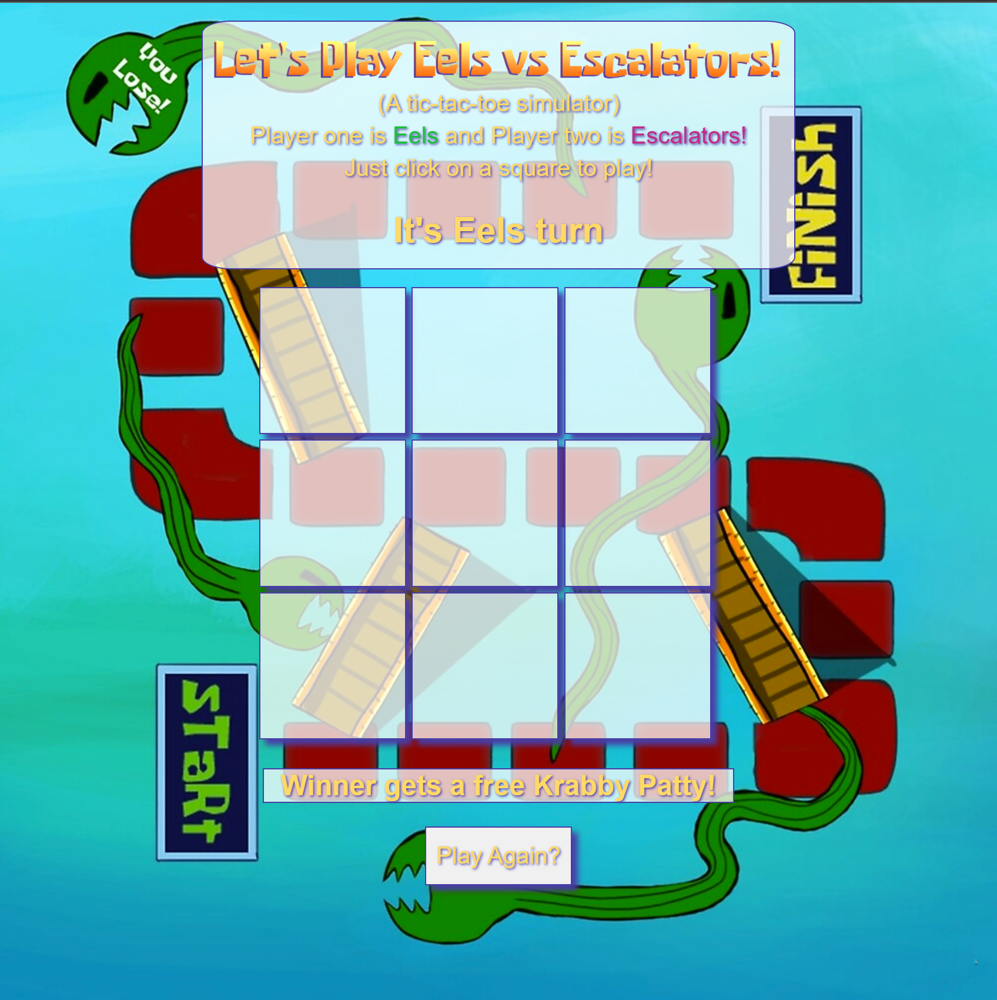

# Tic-Tac-Toe Game!

## Tic-Tac-Toe game (inspired by hit show 'Spongebob Squarepants') made using Object Orientated Programming concepts. Two users can play together and see who wins! 

*Project completed using HTML, CSS, and Javascript.*



<!-- ### Goal: Create a two player Tic-Tac-Toe game. The users should be able to click to place their X or O and if they win the program should mention their win in the DOM. Please make the game as OOP as possible.

### How to submit your code for review:

- Fork and clone this repo
- Create a new branch called answer
- Checkout answer branch
- Push to your fork
- Issue a pull request
- Your pull request description should contain the following:
  - (1 to 5 no 3) I completed the challenge
  - (1 to 5 no 3) I feel good about my code
  - Anything specific on which you want feedback!

Example:
```
I completed the challenge: 5
I feel good about my code: 4
I'm not sure if my constructors are setup cleanly...
```
 -->
