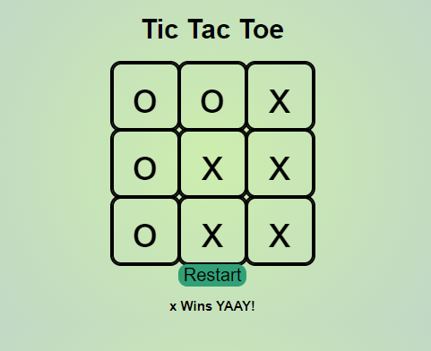

# 📊 Morning Challenge: Tic-Tac-Toe

### Goal: Create a two player Tic-Tac-Toe game. The users should be able to click to place their X or O and if they win the program should mention their win in the DOM. Please make the game as OOP as possible.

This project is a Tic-Tac-Toe game with 9 cells with event listeners on each cell
Each player X & O take turns per click on each cell. 
This was a fun project where i determind each possible win combination.

### How it's Made
Tech used: HTML, CSS, Javascript
I used object orientated programming to create the board so that it would reset check for a win after each turn. This was my first project introducing OOP
### Optimizations

### Lessons Learned
A lesson i learned was how OOP can greatly improve the effcieny of your code & how approaching games with logic works. overall a great project to understand how to approach simple games & projects

## Example

