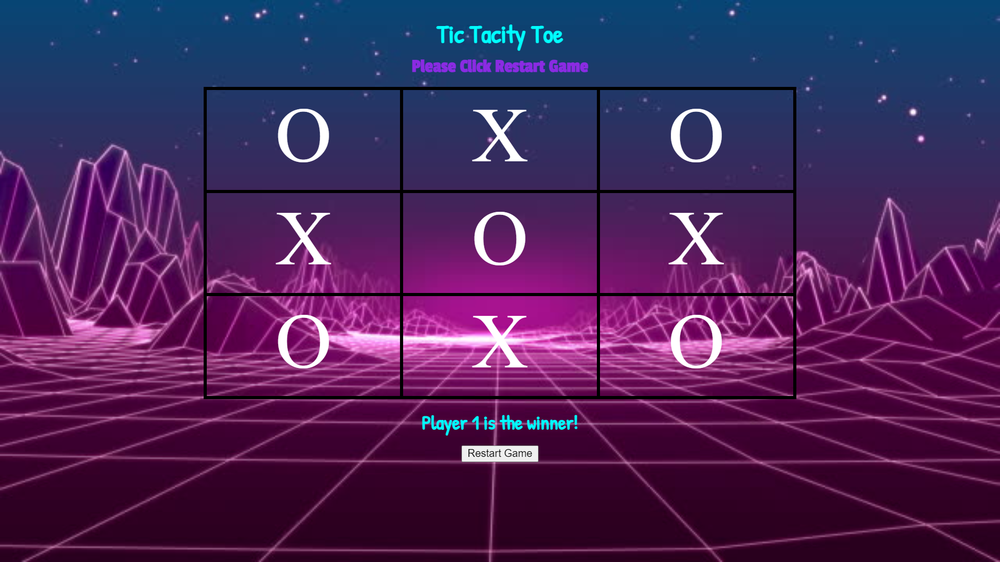

# 📊 Morning Challenge: Tic-Tac-Toe

### Goal: Create a two player Tic-Tac-Toe game. The users should be able to click to place their X or O and if they win the program should mention their win in the DOM. Please make the game as OOP as possible.

 <a href="https://karim-tic-tac-toe.netlify.app/">Link: https://karim-tic-tac-toe.netlify.app//</a>

<strong>Built with HTML, CSS, JavaScript</strong>

