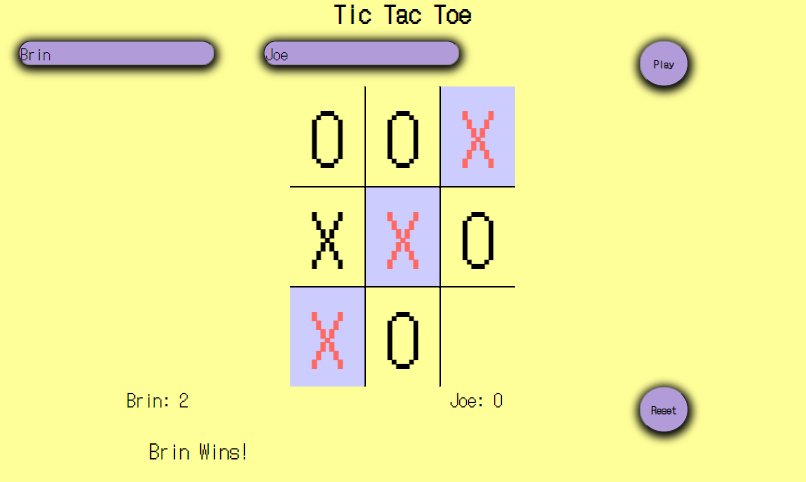

## Tic Tac Toe
Languages used: HTML, CSS, JavaScript

This game of Tic Tac Toe allows user to add 2 players names to play. Press the play button to initiat the game. Towards the bottom of the screen the user will be updated on what players turn it is. Users are only allowed to click the empty boxes until there is a winner. There is a scoreboard keeping track of points for each player and a reset button for restart each game or start a new one.

